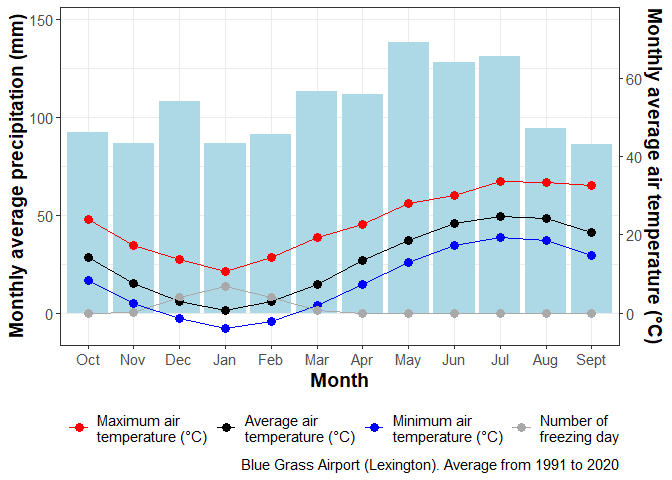

<!-- README.md is generated from README.Rmd. Please edit that file -->

# weatheR 

<!-- badges: start -->

[](https://app.codecov.io/gh/vasseurbenoit/weatheR?branch=main)
[](https://CRAN.R-project.org/package=weatheR)
[](https://github.com/vasseurbenoit/weatheR/actions/workflows/R-CMD-check.yaml)

<!-- badges: end -->

The goal of weatheR is to provide functions that help analyzing and
visualizing weather and climatic data.

- `c` functions are for climate.
- `e` functions are for ETP.
- `r` functions are for radiation.
- `t` functions are for temperature.
- `z` functions are tools.

## Installation

``` r
# install.packages("devtools")
devtools::install_github("vasseurbenoit/weatheR")
```

## Example

This is a basic example which shows you how to solve a common problem:

``` r
# Library
library(weatheR)

# ETP
e_evapotranspiration_fao56(altitude = 30,
                           R_inc = 5,
                           T_air_moy = 20,
                           T_air_min = 10,
                           T_air_max = 30)
#> [1] 3.56085

# Radiation
r_radiation_inc_fao56(longitude = 10,
                      latitude = 35,
                      altitude = 30,
                      date = "2022-11-04",
                      T_air_min = 5,
                      T_air_max = 15)
#> [1] 4.494582

# Temperature
t_growing_degree_days(T_air_avg = 15,
                      T_base = 5,
                      T_opt = 10,
                      T_max = 20,
                      method = "C")
#> $rate_of_development
#> [1] 0.5
#> 
#> $growing_degree_days
#> [1] 7.5

# Climate
c_ombrothermic_diagram(data = weather_blue_grass_airport,
                       year_start = 1991,
                       year_end = 2020,
                       source = "Blue Grass Airport (Lexington)")
#> $table
#> # A tibble: 48 × 4
#>    month  rain variable                        value
#>    <ord> <dbl> <chr>                           <dbl>
#>  1 Jan    86.6 "Average air\ntemperature (°C)"   0.7
#>  2 Jan    86.6 "Minimum air\ntemperature (°C)"  -3.8
#>  3 Jan    86.6 "Maximum air\ntemperature (°C)"  10.6
#>  4 Jan    86.6 "Number of\nfreezing day"         6.7
#>  5 Feb    91.2 "Average air\ntemperature (°C)"   2.9
#>  6 Feb    91.2 "Minimum air\ntemperature (°C)"  -2.1
#>  7 Feb    91.2 "Maximum air\ntemperature (°C)"  14.1
#>  8 Feb    91.2 "Number of\nfreezing day"         3.9
#>  9 Mar   113.  "Average air\ntemperature (°C)"   7.4
#> 10 Mar   113.  "Minimum air\ntemperature (°C)"   2  
#> # ℹ 38 more rows
#> 
#> $diagram
```

<div class="figure" style="text-align: center">


<p class="caption">
Ombrothermic diagram of Lexington Blue Grass Airport.
</p>

</div>
