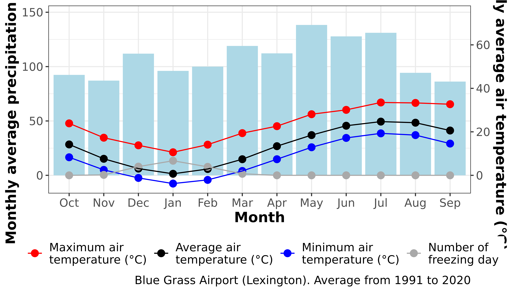
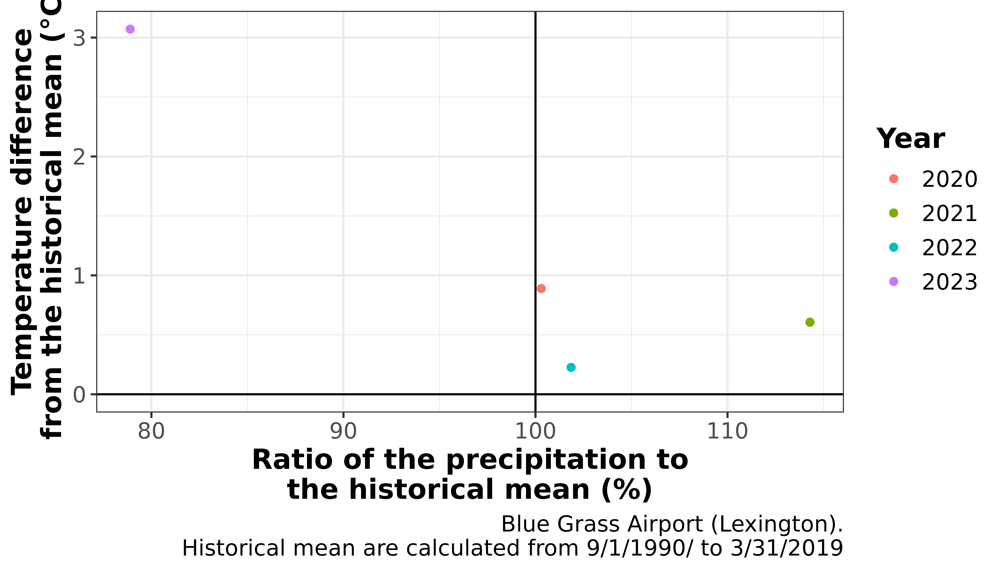

# Climate

## Ombrothermic diagram

    #> $table
    #> # A tibble: 48 × 4
    #>    month  rain variable                        value
    #>    <chr> <dbl> <chr>                           <dbl>
    #>  1 Apr   112.  "Average air\ntemperature (°C)"  13.4
    #>  2 Apr   112.  "Minimum air\ntemperature (°C)"   7.4
    #>  3 Apr   112.  "Maximum air\ntemperature (°C)"  22.6
    #>  4 Apr   112.  "Number of\nfreezing day"         0  
    #>  5 Aug    94.3 "Average air\ntemperature (°C)"  24.2
    #>  6 Aug    94.3 "Minimum air\ntemperature (°C)"  18.5
    #>  7 Aug    94.3 "Maximum air\ntemperature (°C)"  33.3
    #>  8 Aug    94.3 "Number of\nfreezing day"         0  
    #>  9 Dec   112.  "Average air\ntemperature (°C)"   3.1
    #> 10 Dec   112.  "Minimum air\ntemperature (°C)"  -1.2
    #> # ℹ 38 more rows
    #> 
    #> $diagram

## Weather anomaly

    #> $data_thirthy_years_avg
    #> # A tibble: 1 × 2
    #>    rain T_air_avg
    #>   <dbl>     <dbl>
    #> 1   674         8
    #> 
    #> $data_selected_years
    #> # A tibble: 4 × 5
    #>   year   rain T_air_avg ratio_precipitation_historical_…¹ difference_temperatu…²
    #>   <chr> <dbl>     <dbl>                             <dbl>                  <dbl>
    #> 1 2020   676.      8.89                             100.                   0.889
    #> 2 2021   770.      8.61                             114.                   0.606
    #> 3 2022   686.      8.23                             102.                   0.226
    #> 4 2023   532.     11.1                               78.9                  3.07 
    #> # ℹ abbreviated names: ¹​ratio_precipitation_historical_mean_percentage,
    #> #   ²​difference_temperature_historical_mean
    #> 
    #> $plot_selected_years

## References
